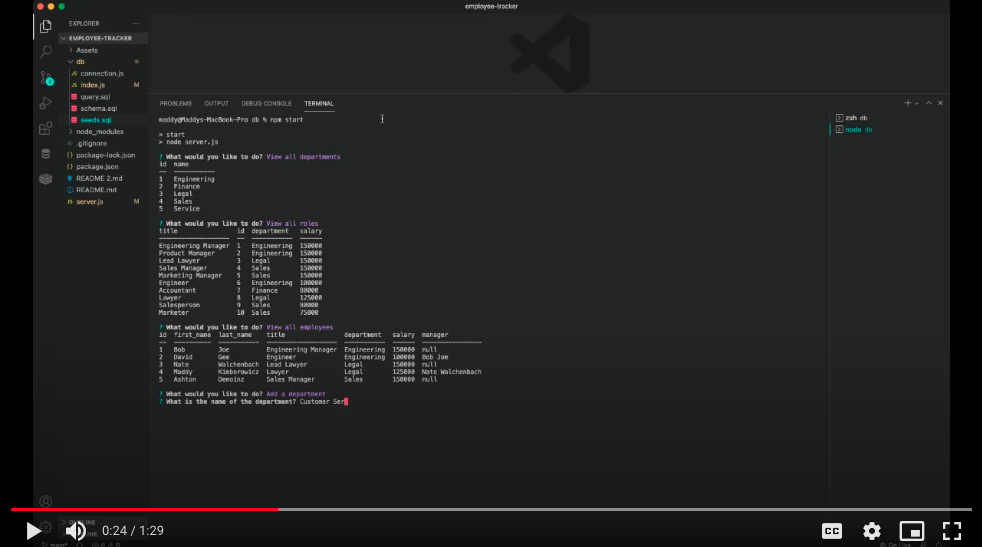

# employee-tracker

This employee tracker can help any business keep track of their employee's, a well as their role, salary, and manager. After starting the application, simply select what you'd like to do and then follow the instructions to make changes or add to your employee database.

**Video Demonstration**

